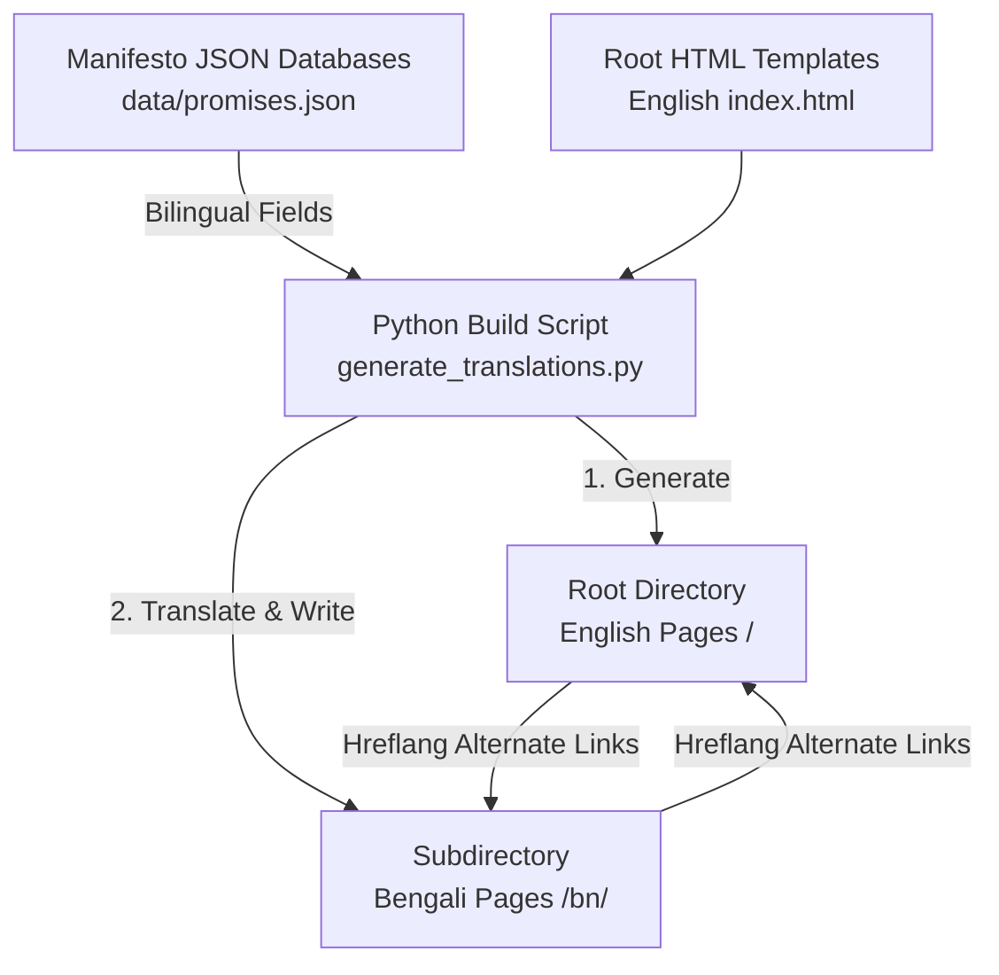

# V3 Roadmap — SEO & Multilingual (Bengali) Architecture Plan

This document outlines the strategic decisions, architectural designs, and implementation steps for **V3 of the West Bengal Promise Tracker**. It preserves our deep architectural discussions on Google Search optimization, Sitemap efficiency, and high-performance, risk-free Bengali language integration.

---

## 1. Executive Summary

The V3 milestone focuses on two core priorities:

1. **Search Engine Optimization (SEO)**: Overriding the default "Cloudflare" site name in Google Search results and establishing the official **`WB Accountability Tracker`** branding.
2. **Multilingual Integration (Bengali)**: Deploying a high-performance, zero-overhead, SEO-friendly Bengali translation system using an automated subdirectory (`/bn/`) compilation architecture.

---

## 2. Google Search Site Names & SEO Update

### The Issue

Google Search results for `https://bjp-govt-wb.pages.dev` displayed the parent brand name **"Cloudflare"** next to the snippet favicon. This is because Google automatically crawls and groups subdomains of shared platforms (like `*.pages.dev`, `*.github.io`, or `*.vercel.app`) under their hosting owner's brand unless overridden by strong metadata signals.

### Implemented Fixes

We deployed explicit metadata signals in `index.html` to force Google to override the hosting provider's default and index the website under the custom **`WB Accountability Tracker`** brand:

1. **Open Graph (Social) Metadata**:

   ```html
   <meta property="og:site_name" content="WB Accountability Tracker">
   ```

2. **JSON-LD Structured Data Schema**:

   ```json
   {
      "@context": "https://schema.org",
      "@type": "WebSite",
      "name": "WB Accountability Tracker",
      "alternateName": [
        "BJP Sarkar Promises",
        "West Bengal Promise Tracker",
        "BJP Sarkar Promises Tracker"
      ],
      "url": "https://bjp-govt-wb.pages.dev/"
    }
    ```

> [!NOTE]
> Changes will propagate to Google Search within **24 to 72 hours** as soon as Googlebot re-crawls the index page.

---

## 3. Sitemap Analysis: Decisive Simplicity

### Decision: **Sitemap Omitted (Unnecessary Over-engineering)**

While sitemaps help search engines find orphan pages, they are not necessary or recommended for the tracker due to the following reasons:

1. **Highly Interconnected Architecture**: The website is small (under 100 pages) and extremely well-linked. Googlebot starts at `index.html` and can discover every page (including `latest.html`, `initiatives.html`, and `details/<promise-id>.html`) through normal HTML links (`<a>` tags).
2. **Maintenance Overhead**: Generating a sitemap creates unnecessary build files and diagnostic errors in Google Search Console if timestamps (`<lastmod>`) fall slightly out of sync.
3. **Lean Codebase**: Keeping the codebase lean and free of unnecessary XML schemas is the best practice for high performance and stress-free long-term maintenance.

---

## 4. Multilingual (Bengali) Integration Blueprint

To support Bengali without lagging performance or triggering duplicate-content SEO penalties, we designed a **Static Subdirectory (`/bn/`) Compile Architecture**.



### 1. Backwards-Compatible JSON Schema

To avoid separate database files, we store English and Bengali texts side-by-side inside the existing JSON structures for all data layers (State Layer, Event Logs, and Evidence Layer):

#### A. State Layer (`data/promises.json` & `data/initiatives.json`)

```jsonc
// data/promises.json
{
  "id": "youth-3",
  "category": "youth",
  "number": 3,
  "text_en": "Provide age relaxation of up to 5 years...",
  "text_bn": "৫ বছর পর্যন্ত বয়স শিথিলকরণ প্রদান করুন...",
  "highlight_en": "Age relaxation up to 5 years",
  "highlight_bn": "৫ বছর পর্যন্ত বয়স শিথিলকরণ",
  "status": "done"
}
```

#### B. Event Log & Evidence Layers (`data/updates.json` & `data/updates/<id>.json`)

To fully translate the timeline feeds (`latest.html` and `initiatives.html`) and dedicated details pages, all event logs and evidence files must support bilingual text blocks:

```jsonc
// data/updates/youth-3.json
{
  "updates": [
    {
      "note_en": "Cabinet approved age relaxation...",
      "note_bn": "ক্যাবিনেট বয়স শিথিলকরণের অনুমোদন দিয়েছে...",
      "sources": [ { "url": "...", "name": "..." } ],
      "counterEvidence": [
        {
          "label_en": "Debatable",
          "label_bn": "বিতর্কিত",
          "text_en": "Some departments haven't implemented it yet...",
          "text_bn": "কিছু বিভাগ এখনও এটি প্রয়োগ করেনি...",
          "sources": [...]
        }
      ]
    }
  ]
}
```

*Note: A Python migration script will automate the translation conversion, keeping keys like `id`, `sources`, and `status` untouched.*

### 2. Zero-Duplicate Build Pipeline

To avoid maintaining duplicate layouts, we utilize a Python compilation script (`generate_translations.py`):

1. **Templates**: The main HTML files in the root folder act as English templates.
2. **Translation Dictionary**: Python houses a key-value dictionary for layout variables (e.g., `"Total Promises"` ➔ `"মোট প্রতিশ্রুতি"`).
3. **Compilation**: The Python script reads the English files, swaps out static texts, translates content fields, and automatically writes the output files directly to `/bn/index.html`, `/bn/latest.html`, and `/bn/details/<promise-id>.html`.
4. **Efficiency**: Runs in less than 1 second, keeping layouts 100% synchronized automatically.

### 3. Bengali Premium Typography Integration (v2.5 Font System Alignment)

To preserve the elite four-font editorial visual hierarchy established in `v2.5`, we must avoid falling back to default browser system fonts for Bengali. We will integrate specialized, high-performance Bengali Google Fonts:

1. **Editorial Serif Headings (`--font-display` Bengali Alternative)**:
   * **Font**: **Noto Serif Bengali**
   * **Usage**: Used for large numbers, titles, category headers, and stats in the Bengali layout.
   * **CSS Variable**: `--font-display-bn: 'Noto Serif Bengali', serif;`

2. **Editorial Prose Body (`--font-sans` Bengali Alternative)**:
   * **Font**: **Noto Serif Bengali** (styled with customized letter-spacing and a highly readable line-height of `1.8` for Bengali characters).
   * **Usage**: Applied to all narrative texts, update notes, and FAQ responses.
   * **CSS Variable**: `--font-sans-bn: 'Noto Serif Bengali', serif;`

3. **Clean UI / Navigation (`--font-ui` Bengali Alternative)**:
   * **Font**: **Hind Siliguri**
   * **Usage**: Applied to navigation bars, buttons, metadata tags, instructions, and interactive tabs.
   * **CSS Variable**: `--font-ui-bn: 'Hind Siliguri', sans-serif;`

4. **Monospace Metadata (`--font-mono` Bengali Alternative)**:
   * **Font**: **Hind Siliguri** or high-quality sans-serif fallback (styled with custom tracking).
   * **CSS Variable**: `--font-mono-bn: 'Hind Siliguri', monospace;`

### 4. Bulletproof SEO Protection (`hreflang`)

To protect our Google rankings and completely eliminate duplicate content flags, both the English and Bengali pages will feature reciprocal standard translation links:

```html
<link rel="alternate" hreflang="en" href="https://bjp-govt-wb.pages.dev/details/youth-3.html">
<link rel="alternate" hreflang="bn" href="https://bjp-govt-wb.pages.dev/bn/details/youth-3.html">
<link rel="alternate" hreflang="x-default" href="https://bjp-govt-wb.pages.dev/details/youth-3.html">
```

---

## 5. Defensive Implementation & Rollout Plan

To ensure **0% risk of breaking the site or causing issues for existing users**, we will follow a strict three-phase rollout plan:

```text
[Phase 1: Local Testbed] ➔ [Phase 2: Invisible Shadow Deployment] ➔ [Phase 3: Public Release]
```

### Phase 1: Local Testbed (100% Safe)

* Build the `generate_translations.py` script.
* Convert the JSON databases to the bilingual schema using an automated script.
* Validate all rendering and toggles on the local Python server (`http://localhost:8000`).

### Phase 2: Shadow Deployment (Invisible to users & search engines)

* Deploy the `/bn/` subdirectory to the Cloudflare Pages server.
* Apply the `noindex` robot directive to `/bn/` pages so they do not show up on Google during testing.
* Verify links and responsiveness in the production environment without letting standard users see them.

### Phase 3: Public Release

* Remove the `noindex` tag from `/bn/` pages.
* Deploy the premium bilingual toggle button ("EN / বাংলা") in the primary navigation header.
* Submit the newly crawled `/bn/` translation URLs to Google Search Console.

---

### Risk Management Summary

| Potential Threat | Prevention Strategy | Risk Level |
| :--- | :--- | :--- |
| **Broken English URLs** | **Zero English directories are touched.** All bookmarks and search results pointing to English `/` stay exactly as they are. | 🟢 **None** |
| **Duplicate Content Penalty** | Standard `hreflang` tags explicitly register the translations with Google's crawler. | 🟢 **None** |
| **JS Crashes / White Screen** | Built-in JavaScript fallbacks automatically display English text if a Bengali translation is missing. | 🟢 **None** |
